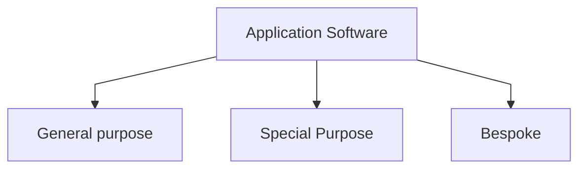

Application Software is software that performs specific tasks for an end-user.

## General purpose
- software that can be used for multiple purposes 
- (Example: word processor / presentation software / spreadsheet )
---
## Special purpose
- software built for a specific purpose
-  (Example: Web browser / media players / calender programs)
---
## Bespoke purpose
- software built for a specific user and purpose
- (Example: car robot control software / military control software/air plane control)