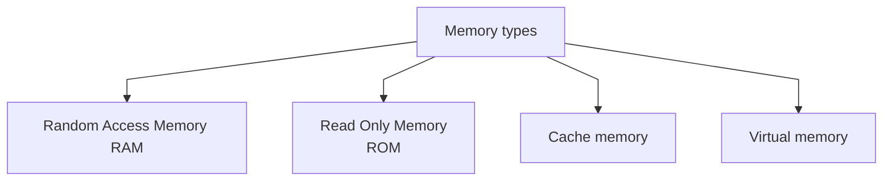

## RAM
- a temporary memory bank where your computer stores data it needs to retrieve quickly. Кароче говоря это оперативная память которая используется только тогда когда запускается какое либо приложение, то есть данная память используется для того чтобы приложение было запущено и работала.

## ROM
- is a memory device or storage medium that stores information permanently. Оно только хранит в себе информацию которую можно прочитать и все, чаще всего используется в БИОС
## Virtual memory
- a method that computers use to manage storage space to keep systems running quickly and efficiently.
- If applications need more memory than a computer has, then the OS will sometimes use a section of secondary storage to mimic RAM

| +                                                  | -                                                 |
| -------------------------------------------------- | ------------------------------------------------- |
| You can run more applications at once              | Applications run slower                           |
| You can run larger applications with less real RAM | It takes more time to switch between applications |
| No need to buy more memory RAM                     | Less hard drive space                             |

## Cache memory
- The purpose of cache memory is to reduce the amount of time needed to access data from main storage or external sources such as disks or networks. By keeping frequently used information close at hand, programs can run more quickly since they don’t have to wait for slower components like hard drives or network connections every time they need something new.
## Difference
| Difference   | RAM                                     | ROM                                             |
| ------------ | --------------------------------------- | ----------------------------------------------- |
| Volatility   | volatile                                | non-volatile                                    |
| Storage      | temporary                               | permanent                                       |
| Cost         | costlier                                | cheaper                                         |
| Speed        | higher                                  | slower                                          |
| Modification | data in RAM can be modified (removable) | data in ROM can not be modified (not removable) |
| Capacity     | RAM sizes from 64 MB to 4GB             | ROM is comparatively smaller than RAM           |
| Types        | Static RAM and Dynamic RAM              | PROM, EPROM, EEPROM                             |
