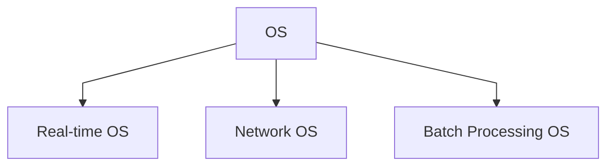

- a system software that manages computer hardware, software resources, and provides common services for computer programs.

## Real-time OS
- is one in which processing requests made by the user are executed immediately. A real-time operating system does not necessarily have to be fast. It simply has to be quick enough to respond to inputs in a predictable way. Computers operating in real time are often dedicated to the control of systems such as industrial processes, planes and space flights. 
- Example: Airline traffic control systems, Command Control Systems, Airlines reservation system
---
## Network OS
- software that connects multiple devices and computers on the network and allows them to share resources on the network. Example: Microsoft Windows Server 2003, UNIX, Linux, Mac OS X
---
## Batch Processing OS
- is a computer OS that processes large amount of data in batches. This type is typically used by buisness and organizations that need to process large amount of data quickly and efficently.
- Example: Payroll System, Bank Statements.