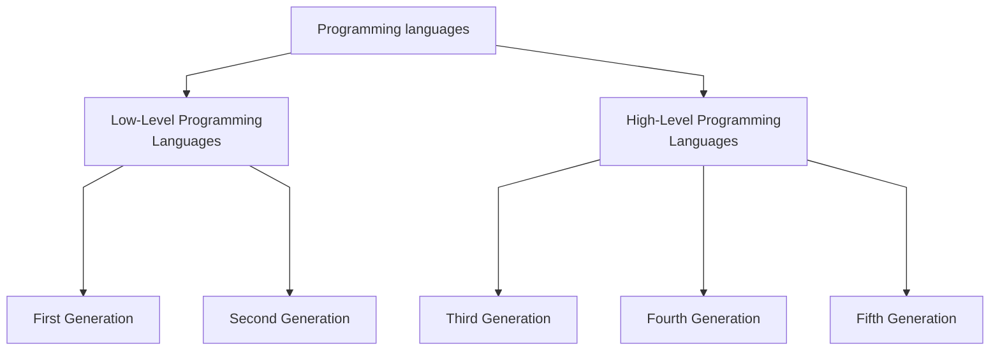

## First Generation
These are low-level languages like machine language. The first-generation languages are also called machine languages/ 1G language. This language is machine-dependent. The machine language statements are written in binary code (0/1 form) because the computer can understand only binary language

## Second-Generation Languages
These are low-level assembly languages used in kernels and hardware drives. The second-generation languages are also called assembler languages/ 2G languages. Assembly language contains human-readable notations (mnemonics) that can be further converted to machine language using an assembler.

## Third-Generation Languages
These are high-level languages like C, C++, Java, Visual Basic, and JavaScript. The third generation is also called procedural language /3 GL. It consists of the use of a series of English-like words that humans can understand easily, to write instructions. It’s also called High-Level Programming Language. For execution, a program in this language needs to be translated into machine language using a Compiler/ Interpreter.

## Fourth-Generation Languages
These are languages that consist of statements that are similar to statements in the human language. These are used mainly in database programming and scripting. Examples of these languages include Perl, Python, Ruby, SQL, and MatLab(MatrixLaboratory). The fourth-generation language is also called a non – procedural language/ 4GL. It enables users to access the database.

## Fifth Generation Languages 
These are the programming languages that have visual tools to develop a program. Examples of fifth-generation languages include Mercury, OPS5, and Prolog. The fifth-generation languages are also called 5GL. It is based on the concept of artificial intelligence. It uses the concept that rather than solving a problem algorithmically, an application can be built to solve it based on some constraints, i.e., we make computers learn to solve any problem. Parallel Processing & superconductors are used for this type of language to make real artificial intelligence.

![[Pasted image 20250414131137.png]]
![[Pasted image 20250414131220.png]]