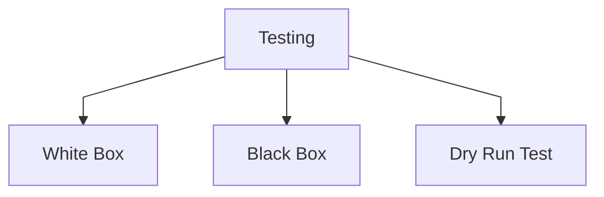

## White Box testing 
- a testing technique where the tester has knowledge of the internal structure of the software being tested. This means that the tester can examine the code, the algorithms, and the data structures used in the software. The objective of white box testing is to ensure that the code is written correctly, and to test the internal logic and flow of the program.

## Black Box testing 
- a testing technique where the tester does not have any knowledge of the internal structure of the software being tested. The tester treats the software as a "black box" and focuses on testing the input and output, as well as the functionality of the software. The objective of black box testing is to ensure that the software meets the specified requirements and is able to handle all possible inputs correctly.

## Dry run testing 
- a type of testing technique that involves running through the software without actually executing the code. The tester uses a simulated environment to test the software and identify any potential issues that may arise during actual execution. Dry run testing is often used during the early stages of software development to identify any design or implementation issues before the actual coding begins.
 ```mermaid
%%{ init: { "flowchart": { "curve": "linear" } } }%%
graph TD
	B[Test Data]
	B --> D[Normal data]
    B --> E[Extreme data]
    B --> F[Boundary data]
    B --> FF[Abnormal data or errorneous]

```


| Test Data                      | Description                                                                                                                                                                                                         |
| ------------------------------ | ------------------------------------------------------------------------------------------------------------------------------------------------------------------------------------------------------------------- |
| Normal data                    | Normal data is test data that is typical (expected) and should be accepted by the system.                                                                                                                           |
| Extreme data                   | Extreme data is test data at the upper or lower limits of expectations that should be accepted by the system.                                                                                                       |
| Boundary data                  | A pair of values at each end of a range: • The data at the upper or lower limits of expectations that should be accepted • The immediate values before or beyond the limits of expectations that should be rejected |
| Abnormal data (erroneous data) | Abnormal data is test data that falls outside of what is acceptable and should be rejected by the system                                                                                                            |

## Examples 
A system has validation to ensure that only integers between 1 and 10 are entered as an input. 

| Test Data                      | Values                                         |
|:------------------------------ | ---------------------------------------------- |
| Normal data                    | 5                                              |
| Extreme data                   | 1, 10 (to be accepted); 0, 11 (to be rejected) |
| Boundary data                  | 1, 10                                          |
| Abnormal data (erroneous data) | 5.7, 14, Thirteen                              |