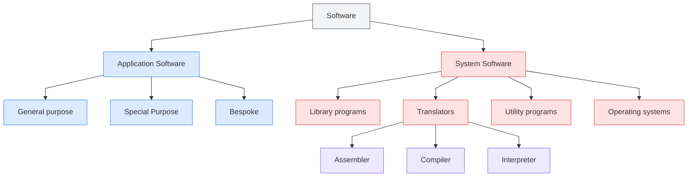

Software - a program or a set of programs used to manage a computer
Hardware - a common term for the physical parts of the computer, both internal and external.

Application software 

```mermaid
%%{ init: { "flowchart": { "curve": "linear" } } }%%
graph TD
    %% Определения стилей
    classDef base fill:#f3f4f6,stroke:#4b5563,stroke-width:2px;       %% Gray
    classDef blue fill:#dbeafe,stroke:#3b82f6,stroke-width:2px;       %% Application Software
    classDef red fill:#fee2e2,stroke:#ef4444,stroke-width:2px;        %% System Software
    classDef purple fill:#ede9fe,stroke:#8b5cf6,stroke-width:2px;     %% Translators

    %% Структура
    A[Software] --> B[Application Software]
    A --> C[System Software]
    B --> D[General purpose]
    B --> E[Special Purpose]
    B --> F[Bespoke]
    C --> G[Library programs]
    C --> H[Translators]
    C --> I[Utility programs]
    C --> J[Operating systems]
    H --> K[Assembler]
    H --> L[Compiler]
    H --> M[Interpreter]

    %% Назначение стилей
    class A base;
    class B,D,E,F blue;
    class C,G,I,J,H red;
    class K,L,M purple;
	click B "obsidian://open?vault=content&file=Ai"

```

