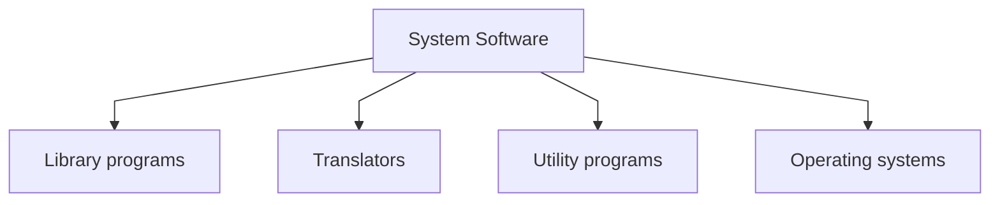

-designed to operate the computer hardware and to provide a platform for running application software.

## Library programs
- are collections of pre-written code, functions, or routines that programmers can use to perform common tasks
- (Example: PIL / Random / Keras )
---
## [[Translators]]

---
## Utility programs
- designed to help manage, maintain, and optimize a computer's performance. They perform specific tasks such as file management, antivirus scanning, disk cleanup, and system backups.
- (Example: antivirus, File Management System, Compression tools, Disk Cleanup tool)
---
## [[Operating systems]]
