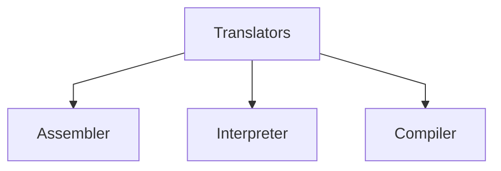

-  translate high-level language programs into machine language programs that the central processing unit (CPU) can understand.

```mermaid
%%{ init: { "flowchart": { "curve": "linear" } } }%%
graph TD
	H[Translators]
	H --> K[Assembler]
    H --> L[Interpreter]
    H --> M[Compiler]
```
- (Example: [[Assembler]] / [[Interpreter]] / [[Compiler]])
---